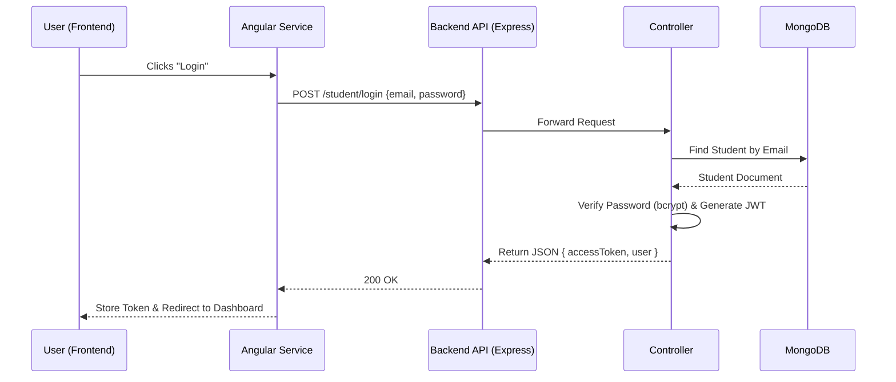

# Technical Architecture Analysis: TIC-Connect

## 1. Executive Summary
**Project Purpose:**
TIC-Connect is a full-stack web platform designed to connect students, companies, and administrators within an academic or professional context (likely ENIT, based on the naming). It facilitates professional networking, internship/job offer management, and document sharing. The platform allows students to create profiles, search for companies, apply for offers, and manage their professional documents, while companies can post offers and view student profiles. Administrators oversee the ecosystem.

**Technology Stack:**

| Component | Technology | Version (Approx) |
| :--- | :--- | :--- |
| **Frontend** | Angular | 10.1.4 |
| **UI Framework** | Bootstrap | 4.5.2 |
| **Backend** | Node.js / Express | 4.17.1 |
| **Database** | MongoDB (Mongoose) | 5.12.3 |
| **Authentication** | JWT (JSON Web Tokens) | 8.5.1 |
| **File Storage** | Local Filesystem (Uploads) | - |

## 2. Repository Structure & Project Anatomy

### Frontend (`TIC-Connect-FrontEnd`)
The frontend is a standard Angular CLI project structured by feature modules.

**Source Directory (`src/app/`):**
```text
src/app/
├── admin/                  # Admin module (components, services, guards)
├── company/                # Company module (components, services, guards)
├── user/                   # Student/User module (components, services, guards)
├── visitor/                # Public/Visitor module (landing page, login)
├── app.component.ts        # Root component
├── app.module.ts           # Root module (imports core modules)
└── app.routing.ts          # Main routing configuration
```

**Routing Strategy:**
The application uses **Angular Router** with **Lazy Loading** to optimize performance. The `app.routing.ts` defines high-level routes that load module bundles on demand:
-   `/visitor` -> `VisitorModule` (Public access)
-   `/user` -> `UserModule` (Guarded by `IsUserGuard`)
-   `/company` -> `CompanyModule` (Guarded by `IsCompanyGuard`)
-   `/admin` -> `AdminModule` (Guarded by `IsAdminGuard`)

**Key Configuration:**
-   `package.json`: Defines Angular 10 dependencies and scripts (`ng build`, `ng serve`).
-   `angular.json`: Angular CLI configuration.
-   `src/environments/`: Contains environment configs (though API URLs appear hardcoded in services).

### Backend (`TIC-Connect-BackEnd`)
The backend is an Express.js application following a Model-Controller-Route architecture.

**Source Directory:**
```text
Backend/
├── config/                 # DB, Auth, Nodemailer, Geocoder configs
├── controllers/            # Business logic (Student, Company, Admin, Offer)
├── helpers/                # Utilities (Storage, Document saving)
├── middlewares/            # Auth middleware (JWT verification)
├── models/                 # Mongoose schemas (Student, Company, Offer, etc.)
├── routes/                 # API route definitions
├── uploads/                # Directory for uploaded files
├── app.js                  # Express app setup (Middleware, CORS, DB connect)
└── server.js               # Server entry point (Port listener)
```

**Application Architecture:**
It uses a **Controller-Service-Model** pattern (though services are merged into controllers here).
-   **Routes** (`routes/*.js`) map HTTP endpoints to Controller functions.
-   **Controllers** (`controllers/*.js`) handle the request logic, interact with Models, and send responses.
-   **Models** (`models/*.js`) define the MongoDB schema using Mongoose.

## 3. Data Flow & System Interaction

### API Specification
The backend exposes a RESTful API. Key endpoints include:

| Method | Endpoint | Description | Request Body | Response |
| :--- | :--- | :--- | :--- | :--- |
| **POST** | `/student/login` | Student Login | `{email, password}` | `{accessToken, userDetails}` |
| **POST** | `/student/signup` | Register Student | `{firstname, lastname, email, ...}` | `{message}` |
| **GET** | `/student/posts` | Get all posts | - | `[Array of Posts]` |
| **POST** | `/student/upload/:id` | Upload Profile Pic | `FormData (image)` | `{message}` |
| **GET** | `/offers` | Get Job Offers | - | `[Array of Offers]` |

**Core Data Models:**
-   **Student:** Profile info, location, status, confirmation code.
-   **Company:** Company details, logo, contact info.
-   **Offer:** Job/Internship offers, linked to Company.
-   **Post:** Community posts/news.
-   **Document:** Files/Folders uploaded by users.

### Frontend-Backend Integration
-   **HTTP Client:** The frontend uses Angular's `HttpClient` service to make AJAX requests.
-   **Services:** Each module (User, Company, Admin) has dedicated services (e.g., `LoginUserService`, `ProfileService`) that encapsulate API calls.
-   **State Management:** State is primarily managed locally within components or passed via Services/Observables (`Subject`, `BehaviorSubject`). There is no global store like NgRx evident, relying instead on `localStorage` for session persistence (tokens).

### Data Flow Diagram


## 4. Key Features & Business Logic

### Authentication & Authorization
-   **Mechanism:** JSON Web Tokens (JWT).
-   **Flow:**
    1.  User logs in.
    2.  Backend verifies credentials and signs a JWT with a secret key.
    3.  Frontend stores the token in `localStorage`.
    4.  Subsequent requests include the token in the `Authorization` header (`Bearer <token>`).
    5.  Backend middleware (`authJwt.verifyToken`) validates the token before allowing access to protected routes.
-   **Roles:** Distinct guards (`IsStudent`, `IsCompany`, `IsAdmin`) ensure users can only access their respective areas.

### Core Features
**1. Student Registration & Verification:**
-   **Frontend:** Registration form collects details.
-   **Backend:** Creates a `Pending` student record with a random `confirmationCode`.
-   **Logic:** Sends an email (via `nodemailer`) with a verification link.
-   **Verification:** Clicking the link hits `/student/confirm/:code`, which updates status to `Active`.

**2. Document Management:**
-   **Frontend:** UI to upload files and create folders.
-   **Backend:** Uses `multer` for handling `multipart/form-data`.
-   **Storage:** Files are saved to the local `uploads/` directory on the server. Metadata is stored in the `Document` MongoDB collection.

**3. Search & Geolocation:**
-   **Search:** Implements fuzzy search using `string-similarity` to find students/companies by name.
-   **Geolocation:** Uses `node-geocoder` to convert addresses to coordinates (lat/long) for map visualization.

## 5. Build, Run & Deployment Instructions

### Prerequisites
-   Node.js (v12.x or v14.x recommended)
-   MongoDB (Local instance or Atlas URI)
-   Angular CLI (`npm install -g @angular/cli`)

### Running Locally

**Backend:**
1.  Navigate to `Backend/` folder.
2.  Install dependencies:
    ```bash
    npm install
    ```
3.  Create a `.env` file (based on usage in `app.js` and `config/`):
    ```env
    PORT=3000
    # Add DB credentials if using config/db.config.js
    ```
4.  Start the server:
    ```bash
    npm start
    ```

**Frontend:**
1.  Navigate to `Frontend/` folder.
2.  Install dependencies:
    ```bash
    npm install
    ```
3.  **Critical Configuration:** You must update the hardcoded API URLs in service files (e.g., `src/app/user/services/login-user.service.ts`) from `https://backend-ticenit.herokuapp.com` to `http://localhost:3000`.
4.  Start the development server:
    ```bash
    ng serve -o
    ```

## 6. Security & Configuration Notes
-   **Security Practices:**
    -   **Password Hashing:** Uses `bcrypt` to hash passwords before storage.
    -   **JWT:** Stateless authentication.
    -   **CORS:** Enabled for all origins (`*`), which is permissive for development but should be restricted for production.
-   **Environment Variables:**
    -   The backend uses `dotenv` but relies heavily on `config/*.js` files which might contain hardcoded credentials or logic to read from env.
-   **Security Concerns:**
    -   **Hardcoded Secrets:** Check `config/auth.config.js` to ensure the JWT secret is not hardcoded in the repo.
    -   **Hardcoded URLs:** Frontend has hardcoded production URLs, making local dev difficult without code changes.
    -   **File Uploads:** Files are stored locally, which is not scalable for ephemeral cloud hosting (like Heroku free tier, where the filesystem is wiped on restart).

## 7. Dependencies & External Services

### Frontend
-   **@angular/core (v10):** The framework core.
-   **bootstrap (v4):** UI styling.
-   **leaflet / @agm/core:** Maps and geolocation visualization.
-   **chartist:** Data visualization (charts).

### Backend
-   **express:** Web server framework.
-   **mongoose:** MongoDB object modeling.
-   **bcrypt:** Password hashing.
-   **jsonwebtoken:** Auth token generation.
-   **nodemailer:** Sending emails (verification, notifications).
-   **multer:** Handling file uploads.
-   **node-geocoder:** Geocoding addresses.

## 8. Conclusions & Recommendations

**Code Quality:**
The code is reasonably structured but shows signs of being a student or MVP project.
-   **Pros:** Clear separation of concerns (MVC), use of Angular modules.
-   **Cons:** Hardcoded URLs, mixed configuration styles, some large controller files (e.g., `student.controller.js` handles too much logic).

**Scalability:**
-   **Bottleneck:** Local file storage for uploads is a major scalability blocker. It prevents horizontal scaling (multiple server instances won't share files).
-   **Database:** MongoDB is scalable, but the search implementation (fetching all records and filtering in JS with `string-similarity`) is highly inefficient for large datasets.

**Suggested Improvements:**
1.  **Externalize Configuration:** Move all API URLs and Secrets to environment files (`environment.ts` in Angular, `.env` in Node).
2.  **Cloud Storage:** Replace local file storage with AWS S3 or Cloudinary for document/image uploads.
3.  **Database Indexing:** Use MongoDB text search indexes instead of loading all data into memory for searching.

## 9. Critical Findings & Immediate Actions

> [!CAUTION]
> **Security Vulnerability: Hardcoded JWT Secret**
> The JSON Web Token (JWT) signing secret is hardcoded as `"azerty123"` in `Backend/config/auth.config.js`. This allows anyone with access to the code to forge tokens and take over any account.
> **Action:** Change this to use `process.env.JWT_SECRET` immediately and rotate the secret.

> [!WARNING]
> **Exposed API Key: HERE Maps**
> A HERE Maps API key is hardcoded in `Backend/config/geocoder.config.js`. This exposes the key to misuse and potential billing charges.
> **Action:** Revoke this key, generate a new one, and store it in an environment variable (`GEOCODER_API_KEY`).

-   **Unused Environment Config:** The `Frontend/src/environments/environment.ts` file is effectively empty. The application **does not** use Angular's built-in environment management for API URLs.
    -   **Impact:** You must manually refactor all service files (e.g., `login-user.service.ts`) to use `environment.apiUrl` instead of hardcoded strings to switch between local and production environments.
-   **Heroku Deployment Optimization:** The presence of a `Procfile` (`web:npm start`) indicates the backend is optimized for Heroku.
    -   **Impact:** If deploying to other platforms (AWS, DigitalOcean), you may need to adjust the start command or use a process manager like PM2.

## 10. Deep Dive Findings & Recommendations

### Frontend Issues
-   **Hardcoded Production URLs:** The Frontend is riddled with hardcoded URLs pointing to `https://backend-ticenit.herokuapp.com`.
    -   **Impact:** The frontend **will not work** with your local backend unless you manually find and replace these URLs in dozens of files.
    -   **Recommendation:** Refactor all services to use `environment.apiUrl` and configure it in `src/environments/environment.ts`.

### Code Quality (Backend)
-   **Legacy JavaScript:** The codebase extensively uses `var` instead of `const`/`let`, indicating outdated practices.
-   **Console Logs:** There are numerous `console.log` statements left in production code (e.g., printing request bodies or errors), which clutters logs and can leak sensitive data.
-   **Error Handling:** Errors are often just logged (`console.log(err)`) without proper propagation or user-friendly responses.

### Dependency Status
-   **Backend:** Node 12 is End-of-Life (EOL). Mongoose 5.12 is outdated.
-   **Frontend:** Angular 10 is significantly outdated (current is v17+).
-   **Security Risk:** Older dependencies likely contain known vulnerabilities. Run `npm audit` to verify.

## 11. Database Configuration (Updated)

### MongoDB Atlas Connection
The application connects to MongoDB Atlas cloud database.

**Current Configuration (.env):**
```env
DB_USER=mohamedfirasberriri_db_user
DB_PASS=lU9lWAZekAUKSmm6
DB_HOST=clusterenit.iqfou3e.mongodb.net
DB_DOMAIN=clusterenit.iqfou3e.mongodb.net
DB_NAME=TIC-ENIT
```

**Database Collections:**

| Collection | Status | Description |
|------------|--------|-------------|
| `companies` | ✅ Exists | Company profiles |
| `students` | ✅ Exists | Student/member profiles |
| `admins` | Created on first admin | Admin users |
| `news` | Created on first post | News articles |
| `offers` | Created on first offer | Job/internship offers |
| `posts` | Created on first post | Community posts |
| `documents` | Created on first upload | Document metadata |
| `messages` | Created on first message | Contact messages |

> **Note:** MongoDB creates collections lazily - they appear when the first document is inserted.

## 12. VPS Deployment Guide (Azure/DigitalOcean/AWS)

### Prerequisites
- VPS with Ubuntu 20.04+ or similar
- Node.js 18+ installed
- PM2 process manager (`npm install -g pm2`)
- Nginx for reverse proxy
- SSL certificate (Let's Encrypt)

### Step 1: Deploy Backend
```bash
# Clone or upload Backend folder
cd /var/www/tic-enit-backend

# Install dependencies
npm install

# Create .env file with production values
nano .env

# Start with PM2
pm2 start server.js --name "tic-backend"
pm2 save
pm2 startup
```

### Step 2: Deploy Frontend
```bash
# Build production bundle
cd Frontend
export NODE_OPTIONS=--openssl-legacy-provider
npm run build

# Copy dist folder to web server
cp -r dist/* /var/www/tic-enit-frontend/
```

### Step 3: Nginx Configuration
```nginx
# /etc/nginx/sites-available/tic-enit
server {
    listen 80;
    server_name yourdomain.com;

    # Frontend
    location / {
        root /var/www/tic-enit-frontend;
        try_files $uri $uri/ /index.html;
    }

    # Backend API
    location /api/ {
        proxy_pass http://localhost:3000/;
        proxy_http_version 1.1;
        proxy_set_header Upgrade $http_upgrade;
        proxy_set_header Connection 'upgrade';
        proxy_set_header Host $host;
    }
}
```

### Step 4: Update Frontend API URL
Before building, update `src/environments/environment.prod.ts`:
```typescript
export const environment = {
  production: true,
  apiUrl: 'https://yourdomain.com/api'
};
```

## 13. Content Management (Admin Panel)

### How to Add Content When Deployed

The application uses an **Admin Panel** for content management. Here's how to access and use it:

#### 1. Admin Login
- Navigate to: `https://yourdomain.com/admin/login`
- Login with admin credentials

#### 2. Adding News
| Endpoint | Method | Description |
|----------|--------|-------------|
| `/admin/news` | POST | Create news article |

**Required Fields:**
- `title`: Article title
- `content`: Article content
- `date`: Publication date
- `picture` (optional): Image URL

#### 3. Adding Offers
| Endpoint | Method | Description |
|----------|--------|-------------|
| `/offers` | POST | Create job/internship offer |

**Required Fields:**
- `title`: Offer title
- `description`: Job description
- `company`: Company ID
- `type`: internship/job

#### 4. Managing Users
| Action | Endpoint | Method |
|--------|----------|--------|
| List students | `/admin/students` | GET |
| Edit student | `/admin/students/:id` | PUT |
| Delete student | `/admin/students/:id` | DELETE |
| List companies | `/admin/companies` | GET |

### Creating Admin Account
To create the first admin account, you need to insert directly into MongoDB:

```javascript
// Using mongosh
use TIC-ENIT

db.admins.insertOne({
  email: "admin@enit.tn",
  password: "$2b$10$...", // bcrypt hashed password
  name: "Admin",
  createdAt: new Date()
})
```

Or use a script:
```javascript
// Backend/scripts/createAdmin.js
const bcrypt = require('bcrypt');
const mongoose = require('mongoose');
require('dotenv').config();

const dbConfig = require('../config/db.config');
mongoose.connect(`mongodb+srv://${dbConfig.user}:${dbConfig.pwd}@${dbConfig.domain}/${dbConfig.DB}`);

const Admin = require('../models/admin.model');

async function createAdmin() {
  const hashedPassword = await bcrypt.hash('your-password', 10);
  await Admin.create({
    email: 'admin@enit.tn',
    password: hashedPassword,
    name: 'Admin'
  });
  console.log('Admin created!');
  process.exit();
}

createAdmin();
```

## 14. Recent Changes (December 2024)

### Completed Fixes
1. ✅ **Removed Heroku Integration** - Scripts and configs updated for VPS deployment
2. ✅ **Added Environment Variables** - All secrets moved to `.env`
3. ✅ **Updated MongoDB Connection** - New Atlas cluster configured
4. ✅ **Removed Uploads Folder** - Social media images replaced with Material Icons
5. ✅ **Updated Footer** - Simple FB, Instagram, LinkedIn icons

### Current Running Configuration
| Service | Port | Status |
|---------|------|--------|
| Frontend | 4200 | Angular dev server |
| Backend | 3000 | Express API server |
| Database | - | MongoDB Atlas (clusterenit) |

